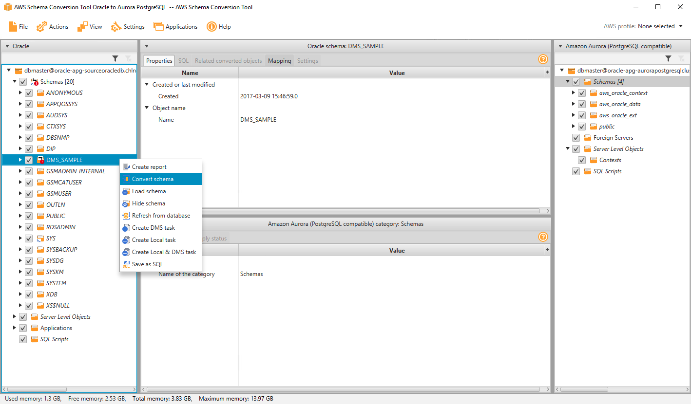

# Migrate your Oracle To Amazon Aurora PostgreSQL

Mystique Unicorn App backend is hosted on Oracle. Recenly one of their devs discovered that AWS offers Amazon Aurora PostgreSQL a fast, scalable, highly available, and fully managed relational database service.

Can you help them migrate from Oracle hosted on prem(or EC2) to Amazon Aurora PostgreSQL?

## 🎯 Solutions

We will follow an multi-stage process to accomplish our goal. We need the following components to get this right,

1. **Source Database - Oracle DB**
   - If in AWS: EC2 instance in a VPC, Security Group, SSH Keypair(Optional)
   - Some dummy data inside the database
   - Oracle DB & Developer tools pre-installed
   - MySQL Workbench pre-installed
1. **Destination Database - Amazon Aurora PostgreSQL**
   - Subnet Groups
   - VPC Security Groups
1. **Database Migration Service(DMS) - Replication Instance**
   - DMS IAM Roles
   - Endpoints
   - Database Migration Tasks


In this article, we will build an architecture, similar to the one shown above - A simple database running oracle instance running on EC2 _(You are welcome to use your own oracle db instead_). For target we will build a Amazon Aurora PostgreSQL cluster and use DMS to migrate the data.

In this Workshop you will practice how to migrate your Oracle DB databases to Amazon Aurora PostgreSQL using different strategies.

1.  ## 🧰 Prerequisites

    This demo, instructions, scripts and cloudformation template is designed to be run in `us-east-1`.

    - 🛠 AWS CLI Installed & Configured - [Get help here](https://youtu.be/TPyyfmQte0U)
    - 🛠 AWS CDK Installed & Configured - [Get help here](https://www.youtube.com/watch?v=MKwxpszw0Rc)
    - 🛠 Python Packages, _Change the below commands to suit your OS, the following is written for amzn linux 2_
      - Python3 - `yum install -y python3`
      - Python Pip - `yum install -y python-pip`
      - Virtualenv - `pip3 install virtualenv`

    As there are a number of components that need to be setup, we will use a combination of Cloudformation(generated from CDK), CLI & GUI.

1.  ## ⚙️ Setting up the environment

    - Get the application code

      ```bash
      git clone https://github.com/miztiik/oracle-to-aurora
      cd oracle-to-aurora
      ```

      **NOTE: RUN THIS STACK IN VIRIGINA ONLY._The ORACLE AMI in th stack is from virigin region_**

1.  ## 🚀 Prepare the environment

    We will need cdk to be installed to make our deployments easier. Lets go ahead and install the necessary components.

    ```bash
    # If you DONT have cdk installed
    npm install -g aws-cdk

    # Make sure you in root directory
    python3 -m venv .venv
    source .venv/bin/activate
    pip3 install -r requirements.txt
    ```

    The very first time you deploy an AWS CDK app into an environment _(account/region)_, you’ll need to install a `bootstrap stack`, Otherwise just go ahead and deploy using `cdk deploy`.

    ```bash
    cdk bootstrap
    cdk ls
    # Follow on screen prompts
    ```

    You should see an output of the available stacks,

    ```bash
    oracle-to-aurora-vpc-stack
    oracle-to-aurora-database-migration-prerequisite-stack
    oracle-to-aurora-oracle-on-client-ec2
    oracle-to-aurora-oracle-on-rds-stack
    ```

1.  ## 🚀 Deploying the Target Database - Amazon Aurora PostgreSQL

    We can automate the creation of Amazon Aurora PostgreSQL & DMS using CDK, But since this will be the first time we use these services,let us use the Console/GUI to set them up. We can leverage the excellant [documentation from AWS](https://docs.aws.amazon.com/AmazonRDS/latest/AuroraUserGuide/CHAP_GettingStartedAurora.CreatingConnecting.AuroraPostgreSQL.html#CHAP_GettingStarted.AuroraPostgreSQL.CreateDBCluster) on how to setup our Aurora DB. (Use your best judgement, as docs tend to change over a period of time)

    Couple of things to note,

    - For VPC - Use our custom VPC `miztiikMigrationVpc`
    - For Security Group - Use `postgres_db_sg_database-migration-prerequisite-stack`
    - Set the admin name as `postgresadmin`
    - Set your `Som3thingSh0uldBe1nVault`

    **NOTE**: Amazon RDS for PostgreSQL creates a default database with the name `postgres`. We will use this later to connect from SCT & Pgadmin

    Make a note of the db endpoint, admin user name and password. We will use it later.

1.  ## 🚀 Deploying the Source Database

    Let us walk through each of the stacks,

    - **Stack: oracle-to-aurora-vpc-stack**
      This stack will do the following,

      1. Create an custom VPC `miztiikMigrationVpc`(_We will use this VPC to host our source Oracle DB, Aurora DB, DMS Replication Instance_)

      Initiate the deployment with the following command,

      ```bash
      cdk deploy oracle-to-aurora-vpc-stack
      ```

    - **Stack: oracle-to-aurora-database-migration-prerequisite-stack**
      This stack will create the following resources,

      1. Aurora PostgreSQL DB & DMS Security groups - (_created during the prerequisite stack_)
      1. DMS IAM Roles - (This stack will **FAIL**, If these roles already exist in your account)
         - `AmazonDMSVPCManagementRole`
         - `AmazonDMSCloudWatchLogsRole`
      1. SSH KeyPair using a custom cfn resource
         - The key material is stored in SSM Parameter Store `mystique-automation-ssh-key`

      Initiate the deployment with the following command,

      ```bash
      cdk deploy oracle-to-aurora-database-migration-prerequisite-stack
      ```

      After successful completion, take a look at all the resources and get yourself familiar with them. We will be using them in the future.

    - **Stack: `oracle-to-aurora-oracle-on-client-ec2` Source Database - Oracle DB**

      We will be using AWS prepared provided AMI. This AMI comes preinstalled with Oracle SQL Developer, pgadmin and Amazon Schema Conversion Tool(SCT) preinstalled. The stack has been designed to run in `viriginia : us-east-1`.

      This stack will do the following,

      1. Create an EC2 `m5.large` instance inside our custom VPC(_created during the prerequisite stack_)
      1. Attach security group with Oracle port(`1521`) open within the VPC (_For any use-case other than sandbox testing, you might want to restrict it_)

      Initiate the deployment with the following command,

      ```bash
      cdk deploy oracle-to-aurora-oracle-on-client-ec2
      ```

      As we need to migrate from Oracle to Amazon Aurora, We need to ensure the schema is compatible between two database engine. We will use the Amazon SCT to achieve that.

      **Prepare Source Oracle Server**

      - Log In to the EC2 server.
        1. To get the Administrator password, Use the SSH key from the SSM Parameter Store.
      - On the EC2 server, open the _DMS Workshop_ folder that is on the Desktop. Then, double-click on _AWS Schema Conversion Tool_ Download to get the latest version of the software. - Continue with the installation

        | Parameter              | Value                                                        |
        | ---------------------- | ------------------------------------------------------------ |
        | Project Name           | AWS Schema Conversion Tool Oracle to Aurora PostgreSQL       |
        | Location               | C:\Users\Administrator\AWS Schema Conversion Tool            |
        | Database Type          | Transactional Database (OLTP)                                |
        | Source Database Engine | Oracle / I want to switch engines and optimize for the cloud |

        

      - Continue to **Next**

        - Use these values

        | Parameter          | Value                                                                                         |
        | ------------------ | --------------------------------------------------------------------------------------------- |
        | Type               | SID                                                                                           |
        | Server Name        | < SourceOracleEndpoint for example `or5wj8knyfkdcl.c78dp8rd21bp.us-east-1.rds.amazonaws.com`> |
        | Server Port        | `1521`                                                                                        |
        | Oracle SID         | `ORACLEDB`                                                                                    |
        | User Name          | `dbmaster`                                                                                    |
        | Password           | `dbmaster123`                                                                                 |
        | Use SSL            | Unchecked                                                                                     |
        | Store Password     | Checked                                                                                       |
        | Oracle Driver Path | C:\Users\Administrator\Desktop\DMS Workshop\JDBC\ojdbc8.jar                                   |

        

      - _Test Connection_
      - You may see a security warning prompot to use SSL. Click on “Accept the Risk and continue” button.
      - Select the `DMS_SAMPLE` database, then click Next.
        
      - Click **Next** and loading metadata, you may get a warning message saying: _Metadata loading was intrupted because of data fetching issues_. You can ignore this message for now.
      - SCT will examine in detail all of the objects in the schema of source database. It will convert as much as possible automatically and provides detailed information about items it could not convert. Generally, packages, procedures, and functions are more likely to have some issues to resolve because they contain the most custom or proprietary SQL code. AWS SCT specifies how much manual change is needed to convert each object type. It also provides hints about how to adapt these objects to the target schema successfully.
        - 
      - Review the database migration assessment report, click **Next**. Specify the target database configurations in the form, and then click Test Connection. Once the connection is successfully tested, click **Finish**.

        | Parameter         | Value                                                                    |
        | ----------------- | ------------------------------------------------------------------------ |
        | Target Database   | Amazon Aurora (PostgreSQL compatible)                                    |
        | Server Name       | < TargetAuroraPostgreSQLEndpoint >                                       |
        | Server Port       | 5432                                                                     |
        | User Name         | `postgresadmin`                                                          |
        | Password          | `Som3thingSh0uldBe1nVault`                                               |
        | Use SSL           | Unchecked                                                                |
        | Store Password    | Checked                                                                  |
        | MySQL Driver Path | `C:\Users\Administrator\Desktop\DMS Workshop\JDBC\postgresql-42.2.9.jar` |

        - 

        - You may see a warning message saying database version that you connected to is 9.x.x.x which is less than the recommended PostgreSQL 10.1. _You can ignore the warning_

      - Right-click on the `DMS_SAMPLE` schema from Oracle source and select _Convert Schema_ to generate the data definition language (DDL) statements for the target database. You can view the generated DDL in the project console, and edit it before applying it to the target database. You can also choose to save it as an `.sql` file for application later.
        
        You may be prompted with a dialog box “Object may already exist in the target database, replace?” Select **Yes** and conversion will start.
      - Click on the **View** button, and choose **Assessment Report view**.
      - AWS SCT analyses the schema and creates a database migration assessment report for the conversion to PostgreSQL. Items with a red exclamation mark next to them cannot be directly translated from the source to the target. This includes Stored Procedures, and Packages. Items with a blue mark next to them cannot be directly translated from the source to the target. In this case, this includes the stored procedures.
        
      - Next, navigate to the **Action Items** tab in the report to see the items that the tool could not convert, and find out how much manual changes you need to make.
      - Check each of the issues listed and compare the contents under the source Oracle panel and the target Aurora PostgreSQL panel. Are the issues resolved? And how?
        
        SCT has proposed resolutions by generating equivalent PostgreSQL DDL to convert the objects. Additionally, SCT highlights each conversion issue where it cannot automatically generate a conversion, and provides you with hints on how you can successfully convert the database object.

        _Notice_ the issue highlighted in the Private procedures named `SELLRANDOMTICKETS`. You’ll see that SCT is unable to automatically convert the assign operation. You can complete one of the following actions to fix the issue:

        1. **Modify** the objects on the source Oracle database so that AWS SCT can convert the objects to the target Aurora PostgreSQL database.

        1. _Instead_ of modifying the source schema, modify scripts that AWS SCT generates before applying the scripts on the target Aurora PostgreSQL database.

        For the sake of time, we skip modifying all the objects that could not be automatically converted. Instead, as an example, you will manually modify one of the stored procedures from within SCT to make it compatible with the target database.

        

      - [_Optionally_] Manually fix the schema issue.
        -Then, right-click on the `DMS_SAMPLE` schema, and choose `Create Report`. Observe that the schema of the source database is now fully compatible with the target database.

      - Right click on the `dms_sample` schema in the right-hand panel, and click `Apply to database`. When prompted if you want to apply the schema to the database, click **Yes**.
        
      - At this point, the schema has been applied to the target database. Expand the `dms_sample` schema to see the tables.
        - You may see an exclamation mark on certain database objects such as indexes, and foreign key constraints. In the next section we will drop foreign key target database.

      You have sucessfully converted the database schema and object from Oracle to the format compatible with Amazon Aurora (PostgreSQL).

      **Enabling Replication on SOURCE Database:**

      - open _Oracle SQL Developer_ from the Taskbar.
        
      - Click on the plus sign from the left-hand menu to create a _New Database Connection_ using the following values.
      - After the you see the _test_ status as Successful, **Connect**.

        | Parameter         | Value                                                                                         |
        | ----------------- | --------------------------------------------------------------------------------------------- |
        | Connection Name   | Source Oracle                                                                                 |
        | Username          | `dbmaster`                                                                                    |
        | Password          | `dbmaster123`                                                                                 |
        | **Save Password** | Check                                                                                         |
        | Hostname          | < SourceOracleEndpoint For example `or5wj8knyfkdcl.c78dp8rd21bp.us-east-1.rds.amazonaws.com`> |
        | Port              | `1521`                                                                                        |
        | SID               | `ORACLEDB`                                                                                    |

        

        To use Oracle as a source for AWS Database Migration Service (AWS DMS), you must first provide a user account (DMS user) with read and write privileges on the Oracle database.

        You also need to ensure that `ARCHIVELOG MODE` is on to provide information to _LogMiner_. AWS DMS uses LogMiner to read information from the archive logs so that AWS DMS can capture changes.

        For AWS DMS to read this information, make sure the archive logs are retained on the database server as long as AWS DMS requires them. Retaining archive logs for 24 hours is usually sufficient.

        To capture change data, AWS DMS requires database-level supplemental logging to be enabled on your source database. Doing this ensures that the LogMiner has the minimal information to support various table structures such as clustered and index-organized tables.

        Similarly, you need to enable t*able-level supplemental logging* for each table that you want to migrate.

      - Click on the SQL Worksheet icon within Oracle SQL Developer, then connect to the Source Oracle database.

        

      - Next, execute the below statements to grant the following privileges to the AWS DMS user to access the source Oracle endpoint:

        ```sql
        GRANT SELECT ANY TABLE to DMS_USER;
        GRANT SELECT on ALL_VIEWS to DMS_USER;
        GRANT SELECT ANY TRANSACTION to DMS_USER;
        GRANT SELECT on DBA_TABLESPACES to DMS_USER;
        GRANT SELECT on ALL_TAB_PARTITIONS to DMS_USER;
        GRANT SELECT on ALL_INDEXES to DMS_USER;
        GRANT SELECT on ALL_OBJECTS to DMS_USER;
        GRANT SELECT on ALL_TABLES to DMS_USER;
        GRANT SELECT on ALL_USERS to DMS_USER;
        GRANT SELECT on ALL_CATALOG to DMS_USER;
        GRANT SELECT on ALL_CONSTRAINTS to DMS_USER;
        GRANT SELECT on ALL_CONS_COLUMNS to DMS_USER;
        GRANT SELECT on ALL_TAB_COLS to DMS_USER;
        GRANT SELECT on ALL_IND_COLUMNS to DMS_USER;
        GRANT SELECT on ALL_LOG_GROUPS to DMS_USER;
        GRANT LOGMINING TO DMS_USER;
        ```

      

      - In addition, run the following:

        ```sql
        exec rdsadmin.rdsadmin_util.grant_sys_object('V_$ARCHIVED_LOG','DMS_USER','SELECT');
        exec rdsadmin.rdsadmin_util.grant_sys_object('V_$LOG','DMS_USER','SELECT');
        exec rdsadmin.rdsadmin_util.grant_sys_object('V_$LOGFILE','DMS_USER','SELECT');
        exec rdsadmin.rdsadmin_util.grant_sys_object('V_$DATABASE','DMS_USER','SELECT');
        exec rdsadmin.rdsadmin_util.grant_sys_object('V_$THREAD','DMS_USER','SELECT');
        exec rdsadmin.rdsadmin_util.grant_sys_object('V_$PARAMETER','DMS_USER','SELECT');
        exec rdsadmin.rdsadmin_util.grant_sys_object('V_$NLS_PARAMETERS','DMS_USER','SELECT');
        exec rdsadmin.rdsadmin_util.grant_sys_object('V_$TIMEZONE_NAMES','DMS_USER','SELECT');
        exec rdsadmin.rdsadmin_util.grant_sys_object('V_$TRANSACTION','DMS_USER','SELECT');
        exec rdsadmin.rdsadmin_util.grant_sys_object('DBA_REGISTRY','DMS_USER','SELECT');
        exec rdsadmin.rdsadmin_util.grant_sys_object('OBJ$','DMS_USER','SELECT');
        exec rdsadmin.rdsadmin_util.grant_sys_object('ALL_ENCRYPTED_COLUMNS','DMS_USER','SELECT');
        exec rdsadmin.rdsadmin_util.grant_sys_object('V_$LOGMNR_LOGS','DMS_USER','SELECT');
        exec rdsadmin.rdsadmin_util.grant_sys_object('V_$LOGMNR_CONTENTS','DMS_USER','SELECT');
        exec rdsadmin.rdsadmin_util.grant_sys_object('DBMS_LOGMNR','DMS_USER','EXECUTE');
        ```

      

      - Run the following query to retain archived redo logs of the source Oracle database instance for 24 hours:

        ```sql
        exec rdsadmin.rdsadmin_util.set_configuration('archivelog retention hours',24);
        ```

      - Run the following query to enable database-level supplemental logging:

        ```sql
        exec rdsadmin.rdsadmin_util.alter_supplemental_logging('ADD');
        ```

      - Run the following query to enable PRIMARY KEY logging for tables that have primary keys:

        ```sql
        exec rdsadmin.rdsadmin_util.alter_supplemental_logging('ADD','PRIMARY KEY');
        ```

      - Run the following queries to add supplemental logging for tables that don’t have primary keys, use the following command to add supplemental logging:

        ```sql
        alter table dms_sample.nfl_stadium_data add supplemental log data (ALL) columns;
        alter table dms_sample.mlb_data add supplemental log data (ALL) columns;
        alter table dms_sample.nfl_data add supplemental log data (ALL) columns;
        ```

        

      Now we are all done with our source database.

    **Prepare TARGET: Aurora PostgreSQL**

    During the _full load_ process, AWS DMS as default does not load tables in any particular order, so it might load child table data before parent table data. As a result, foreign key constraints might be violated if they are enabled. Also, if triggers are present on the target database, they might change data loaded by AWS DMS in unexpected ways. To overcome this, we drop the constraints on the target database.

    - Open **pgAdmin** from within the EC2 server

      

      You may be prompted to set a Master Password. Enter `dbmaster123`, then click, OK.
      

    - Click on the `Add New Server` icon, and enter the following values. Then, press **Save**.

      | Parameter                       | Value                              |
      | ------------------------------- | ---------------------------------- |
      | General -> Name                 | Target Aurora RDS (PostgreSQL)     |
      | Connection -> Host Name/Address | < TargetAuroraPostgreSQLEndpoint > |
      | Connection -> Port              | 5432                               |
      | Connection -> Username          | `postgresadmin`                    |
      | Connection -> Password          | `Som3thingSh0uldBe1nVault`         |
      | Connection -> Save Password     | Check                              |

      

    - Right-click on Target AuroraDB database from left-hand menu, and then select Query Tool.
      

    - In this step you are going to drop the foreign key constraint from the target database:

    - Open `prep_target_postgres_DropConstraintsPostgreSQL.sql` in your favorite text editor. Copy the content of the file to the Query Editor in pgAdmin. Execute the script.
      

      Now we are all done with our target database & ready for migration.

1.  ## 🚀 Deploying the DMS Replication Instance

    We can leverage the excellant [documentation from AWS](https://docs.aws.amazon.com/dms/latest/userguide/CHAP_GettingStarted.html) on how to setup our DMS Replication Instance.

    Couple of things to note,

    - For VPC - Use our custom VPC `miztiikMigrationVpc`
    - For Security Group - Use `dms_sg_database-migration-prerequisite-stack`

    After creating the replication instance, We need to create few more resources to begin our replication. We will use defaults mostly

    - **Endpoints for source Oracle DB**(_custom values listed below_)

      | Parameter            | Value                                            |
      | -------------------- | ------------------------------------------------ |
      | Endpoint             | Type Source endpoint                             |
      | Endpoint Identifier  | `oracle-source`                                  |
      | Source Engine        | `oracle`                                         |
      | Server Name          | < SourceOracleEndpoint >                         |
      | Port                 | 1521                                             |
      | SSL Mode             | none                                             |
      | User Name            | `dbmaster`                                       |
      | Password             | `dbmaster123`                                    |
      | SID/Service Name     | `ORACLEDB`                                       |
      | Test                 | endpoint connection -> VPC `miztiikMigrationVpc` |
      | Replication Instance | DMSReplication                                   |

    - **Endpoint for destination databases - Amazon Aurora PostgreSQL**(_custom values listed below_)

      | Parameter            | Value                                            |
      | -------------------- | ------------------------------------------------ |
      | Endpoint             | Type Target endpoint                             |
      | Select               | RDS DB instance                                  |
      | Endpoint Identifier  | `aurora-target`                                  |
      | Source Engine        | aurora-postgresql                                |
      | Server Name          | < TargetAuroraPostgreSQLEndpoint >               |
      | Port                 | 5432                                             |
      | SSL Mode             | none                                             |
      | User Name            | `postgresadmin`                                  |
      | Password             | `Som3thingSh0uldBe1nVault`                       |
      | Database Name        | `postgres`                                       |
      | Test                 | endpoint connection -> VPC `miztiikMigrationVpc` |
      | Replication Instance | DMSReplication                                   |

    - **Database Migration Task**

      - Click on Database migration tasks on the left-hand menu, then click on the Create task button on the top right corner.

      | Parameter                          | Value                 |
      | ---------------------------------- | --------------------- |
      | Task identifier                    | OracleMigrationTask   |
      | Replication instance               | DMSReplication        |
      | Source database endpoint           | `oracle-source`       |
      | Target database endpoint           | `aurora-target`       |
      | Migration type                     | Migrate existing data |
      | Start task on create               | Checked               |
      | Target table preparation mode      | Do nothing            |
      | Include LOB columns in replication | Limited LOB mode      |
      | Max LOB size (KB)                  | 32                    |
      | Enable validation                  | Unchecked             |
      | Enable CloudWatch logs             | Checked               |

      - Expand the Table mappings section, and select Guided UI for the editing mode.

      - Click on Add new selection rule button and enter the following values in the form:

        | Parameter  | Value        |
        | ---------- | ------------ |
        | Schema     | `DMS_SAMPLE` |
        | Table name | %            |
        | Action     | Include      |

      - Next, expand the Transformation rules section, and click on Add new transformation rule using the following values:
        **Rule 1:**

        | Parameter   | Value          |
        | ----------- | -------------- |
        | Target      | Schema         |
        | Schema Name | DMS_SAMPLE     |
        | Action      | Make lowercase |

        **Rule 2:**

        | Parameter   | Value          |
        | ----------- | -------------- |
        | Target      | Table          |
        | Schema Name | DMS_SAMPLE     |
        | Action      | Make lowercase |

        **Rule 2:**

        | Parameter   | Value          |
        | ----------- | -------------- |
        | Target      | Column         |
        | Schema Name | DMS_SAMPLE     |
        | Action      | Make lowercase |

      - Create Task. At this point, the task should start running and replicating data from the `dms_sample` database running on EC2 to the Amazon Aurora RDS (MySQL) instance.
      - You can check the table statistics for the migration progress

1.  ## 🔬 Test Full Data Load and Continuous Replication

    Navigate to DMS task, under `Table Statistics` You should be able observe that the dms has copied the data from source to target database. You can connect to Aurora DB and test the records using the same commands that we used with source earlier.

    - Connect to Aurora from _pgadmin_ and query for data,

      ```sql
      SELECT *
      FROM dms_sample_dbo.sport_type;
      ```

      

    - **AFTER** initial load is completed, use the following script to enable the foreign key constraints that we dropped earlier:
      1. Within pgadmin, click on the File menu, and choose New Query Tab.
      1. Open `add_constraints_to_target_postgres_AddConstraintsPostgreSQL.sql` with a text editor on your computer.
      1. Copy the content to pgadmin query editor.
      1. Execute the script.

    

    _Additional Learnings:_ You can check the logs in cloudwatch for more information or increase the logging level of the database migration task.

1.  ## 📒 Conclusion

    Here we have demonstrated how to use Amazon Database Migration Service(DMS) to migrate data from Oracle DB to Aurora Postgresql DB.

1.  ## 🎯 Additional Exercises

    - Try and fix the other stored procedure that were excluded.
    - You can create another replication task for migrating ongoing changes.

1.  ## 📊 📈 Performance Tips

    If your table has volume transactions, > 100 tps, then you can try these,

    - Create muliple replication instances
    - Create tasks for each of the tables to be migrated
    - Perform full load and CDC

1)  ## 🧹 CleanUp

    If you want to destroy all the resources created by the stack, Execute the below command to delete the stack, or _you can delete the stack from console as well_

    - Resources created during [Deploying The Application](#deploying-the-application)
    - Delete CloudWatch Lambda LogGroups
    - _Any other custom resources, you have created for this demo_

    ```bash
    # Delete from cdk
    cdk destroy

    # Follow any on-screen prompts

    # Delete the CF Stack, If you used cloudformation to deploy the stack.
    aws cloudformation delete-stack \
        --stack-name "MiztiikAutomationStack" \
        --region "${AWS_REGION}"
    ```

    This is not an exhaustive list, please carry out other necessary steps as maybe applicable to your needs.

## 📌 Who is using this

This repository aims to teach api best practices to new developers, Solution Architects & Ops Engineers in AWS. Based on that knowledge these Udemy [course #1][103], [course #2][102] helps you build complete architecture in AWS.

### 💡 Help/Suggestions or 🐛 Bugs

Thank you for your interest in contributing to our project. Whether it's a bug report, new feature, correction, or additional documentation or solutions, we greatly value feedback and contributions from our community. [Start here](/issues)

### 👋 Buy me a coffee

[](https://ko-fi.com/Q5Q41QDGK) Buy me a [coffee ☕][900].

### 📚 References

1. [Oracle database as a source for AWS DMS][1]

1. [PostgreSQL database as a target for AWS DMS][2]

1. [Connecting to a DB instance running the PostgreSQL database engine][3]

### 🏷️ Metadata


**Level**: 300

[1]: https://docs.aws.amazon.com/dms/latest/userguide/CHAP_Source.Oracle.html
[2]: https://docs.aws.amazon.com/dms/latest/userguide/CHAP_Target.PostgreSQL.html
[3]: https://docs.aws.amazon.com/AmazonRDS/latest/UserGuide/USER_ConnectToPostgreSQLInstance.html
[100]: https://www.udemy.com/course/aws-cloud-security/?referralCode=B7F1B6C78B45ADAF77A9
[101]: https://www.udemy.com/course/aws-cloud-security-proactive-way/?referralCode=71DC542AD4481309A441
[102]: https://www.udemy.com/course/aws-cloud-development-kit-from-beginner-to-professional/?referralCode=E15D7FB64E417C547579
[103]: https://www.udemy.com/course/aws-cloudformation-basics?referralCode=93AD3B1530BC871093D6
[899]: https://www.udemy.com/user/n-kumar/
[900]: https://ko-fi.com/miztiik
[901]: https://ko-fi.com/Q5Q41QDGK
